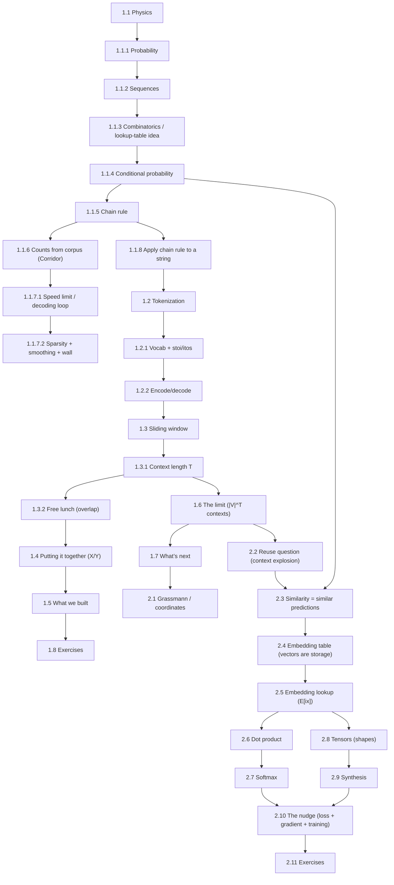

# BabyGPT Concept Map (Chapters 1–2)

This file is a **meta-structure** for the book.

It exists to prevent:
- forward references (using a concept before we taught it)
- explaining the same idea twice in two different places
- “name-dropping” (terms with no first-principles setup)

If you change chapter structure, update this file in the same PR.

---

## Chapter 1 — The Meat Grinder

**Mental model:** we start with probability from scratch, then show why sequences are hard, then build a counting model, then turn text into training pairs.

| Section | Title | Introduces (first appearance) | Uses (assumed known) | Main components/vizzes |
|---:|---|---|---|---|
| 1.1 | The Physics of the Problem | “language modeling = predicting the next token” framing | none | — |
| 1.1.1 | What Even Is Probability | probability as frequency, distributions sum to 1, events/outcomes | arithmetic | — |
| 1.1.2 | The Problem With Sequences | joint probability of a sequence, why “memorize every sequence” fails | probability basics | — |
| 1.1.3 | Why This Happens | combinatorics / exponential growth of sequences, naive lookup-table idea | joint probability idea | — |
| 1.1.4 | Conditional Probability | conditioning changes the distribution, `P(next | context)` as the primitive | probability basics | — |
| 1.1.5 | The Chain Rule | product decomposition of joint probability; why “AND” becomes multiply | conditional probability | — |
| 1.1.6 | Building Probabilities From a Corpus | counting → probabilities; prefix corridor intuition; “narrowing” as conditioning | chain rule framing | `CorridorDemo` |
| 1.1.7.1 | The Hidden Graph & The Speed Limit | decoding loop, why we need *fast* lookups; practical constraints | counting model | `DecoderDemo`, KenLM narrative |
| 1.1.7.2 | The Sparsity Trap | zeros from unseen contexts; smoothing/backoff intuition; generalization wall | counting model + decoding loop | `ExplosionDemo` (Generalization Wall) |
| 1.1.8 | Applying the Chain Rule | compute probability of a string by multiplying stepwise probs; connect to training objective | chain rule, counts | `NgramSamplingDemo` (if present), worked examples |
| 1.2 | The Actual Meat Grinder: Tokenization | tokens/IDs, why models need integers | counting model story | — |
| 1.2.1 | Building the Vocabulary | unique symbols → vocab; `stoi`/`itos` as mappings | tokenization premise | — |
| 1.2.2 | Encoding and Decoding | encode/decode mechanics (text ↔ IDs) | vocab | `CodeWalkthrough` |
| 1.3 | The Sliding Window | training pairs `(context → target)` from a stream | encoding | `SlidingWindowDemo` |
| 1.3.1 | Context Length | what “context length T” means operationally (sliding window) | sliding window | `ContextTrace`, `TrainingExamples` |
| 1.3.2 | The Free Lunch | overlapping windows create many training examples from one corpus | context length | — |
| 1.4 | Putting It Together | assemble dataset X/Y; what the model actually consumes | all above | `CodeBlock`, `TrainingExamples` |
| 1.5 | What We Built | recap: what exists in code after Chapter 1 | Chapter 1 pipeline | — |
| 1.6 | The Limit | why pure tables do not scale; table size as `|V|^T` contexts and `|V|^{T+1}` stored values | context length | `ContextExplosionViz` |
| 1.7 | What’s Next | preview: Chapter 2 replaces tables with shared vectors | Chapter 1 limits | — |
| 1.8 | Exercises | practice: counting, tokenization, sliding window, basic evaluation | Chapter 1 pipeline | `Exercise` |

---

## Chapter 2 — The Map

**Mental model:** a token ID is just a name tag. We store a reusable vector per token, define what “similar” means, and learn vectors that make similar contexts behave similarly.

| Section | Title | Introduces (first appearance) | Uses (assumed known) | Main components/vizzes |
|---:|---|---|---|---|
| 2.1 | Grassmann’s Insight | coordinates for abstract objects; “map” metaphor for embeddings | Chapter 1 pipeline | `GrassmannViz`, `AbstractionChainViz` |
| 2.2 | The Reuse Question | context explosion restated as the scaling enemy | Chapter 1 limit | `ContextExplosionViz` |
| 2.3 | What Can We Measure? | definition of similarity via predictive behavior (next-token stats) | conditional probability | `CharacterClusterViz` |
| 2.4 | Vectors Are Just Storage | embedding table = one row per token; vectors as learnable storage | “reuse” goal | `MatrixRowSelectViz` |
| 2.5 | The Embedding Lookup | `E[ix]` row selection; one-hot as a conceptual tool | embeddings table | `OneHotViz` |
| 2.6 | Measuring Similarity: Overlap (Dot Product) | dot product as overlap score and geometric operation | vectors | `DotProductViz`, `GeometricDotProductViz` |
| 2.7 | From Scores to Probabilities (Softmax) | score → probability distribution; temperature intuition | dot products/scores | `SoftmaxWidget`, `SoftmaxSimplexViz` |
| 2.8 | Tensors: Batching Patterns | shapes `[B,T] → [B,T,D]`; batching as bookkeeping | embedding lookup | `TensorShapeBuilder` |
| 2.9 | Synthesis: From Counts to Coordinates | full forward pass pipeline, end-to-end summary | 2.1–2.8 | — |
| 2.10 | The Nudge | loss as “surprise”; gradient as the direction of change; training loop | probabilities | `CrossEntropyViz`, `GradientDescentViz`, `GradientTraceDemo`, `TrainingDynamicsViz`, `NeuralTrainingDemo`, `EmbeddingGradientViz` |
| 2.11 | Exercises | practice: IDs → vectors → scores → probs → loss → update | Chapter 2 pipeline | `Exercise` |

---

## Dependency Graph (Mermaid)

---

## Anti-regression checklist

- A concept is introduced once, clearly, then referenced later (no “second first introduction”).  
- No forward references: if a section uses a term, the first-principles explanation is earlier in the graph.  
- Token granularity is explicit when relevant (characters vs words vs tokens).  
- Inline math uses `MathInline` when it must look like math (fractions/exponents), not raw `^` or `1/2`.  
- Visual components have a “job”: if something is core narrative, it is not buried as a side callout.  

