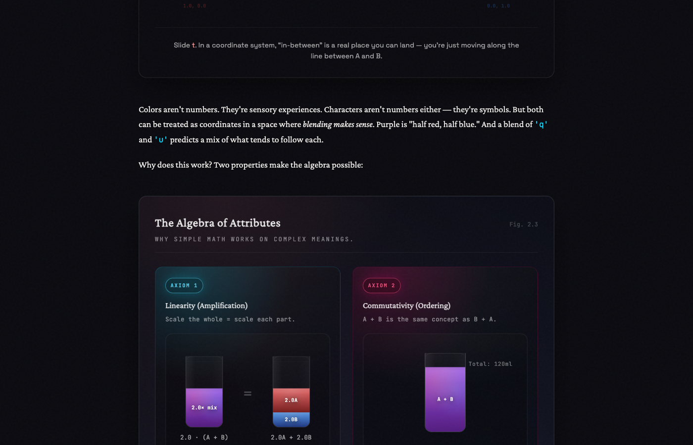

# BabyGPT Visual Language — Audit (2025-12-21)

This is an **audit of the current visual system** used by visualization components and interactive demos.

Goal: make it easy for any engineer to add a new viz that *looks like BabyGPT* without guessing.

## Visual references (Playwright screenshots)

These are “what we mean” pictures. They live in `docs/assets/visual-audit/`.

For the “why”, see:

- `docs/assets/visual-audit/gold/README.md` (what to copy)
- `docs/assets/visual-audit/drift/README.md` (what’s drifting + fix direction)

**Gold / target-ish**

- `docs/assets/visual-audit/gold/audit-ch2-axioms-vizcard.png` — `VizCard` “figure” style (serif title, mono subtitle, glass surface, calm gradients).
- `docs/assets/visual-audit/gold/audit-ch2-softmax-simplex.png` — `VizCard` + sliders + “cyan/magenta/yellow as semantic channels”.
- `docs/assets/visual-audit/gold/audit-ch2-softmax-landscape.png` — `VizCard` + interactive 3D-ish plot surface.
- `docs/assets/visual-audit/gold/audit-ch1-corridor.png` — “terminal/window” demo motif (top bar, code-ish panels, restrained glow).
- `docs/assets/visual-audit/gold/audit-ch1-kenlm.png` — another “engineer’s window” motif (structured layout, mono labels, restrained contrast).

**Drift / mismatched**

- `docs/assets/visual-audit/drift/audit-ch2-neuraltraining.png` — legacy heatmap + saturated red/green blocks + “default-ish” controls.
- `docs/assets/visual-audit/drift/audit-ch1-sparsemarkov-full.png` — raw orange/green/red palette + bespoke heading/badges that don’t match the rest.
- `docs/assets/visual-audit/drift/audit-ch2-onehot.png` — “faded” / low-contrast viz with its own surface tokens + inconsistent density.

If you’re not sure what to build: copy the *structure* of the “Gold” ones first, then adapt content.

## Scope (what was audited)

Files: `src/components/*{Viz,Demo}.tsx` and their `*.module.css` counterparts (34 components).

## What “consistency” means (in this project)

We don’t need every viz to look identical. We *do* need a shared vocabulary:

- **Semantic colors** (cyan/magenta/yellow/green/red mean consistent things).
- **Surface palette** (a small set of backgrounds: glass card, panel, code/terminal).
- **Typography hierarchy** (serif for narrative headings, mono for labels/metrics, etc).
- **Shared UI primitives** (buttons, sliders, pills should feel like the same product).

## Current “style families”

### A) `VizCard` (glass card + ambient glow)

These vizzes use `VizCard` (which itself applies `ambient-glow` + `card-glass`):

- `AbstractionChainViz`
- `CausalMaskViz`
- `ConditioningShiftViz`
- `ContextExplosionViz`
- `EmbeddingGradientViz`
- `ExplosionDemo`
- `GeneralizationGapViz`
- `GeometricDotProductViz`
- `GradientDescentViz`
- `GradientTraceDemo`
- `SoftmaxLandscapeViz`
- `SoftmaxSimplexViz`

**Pros:** consistent header, spacing, and outer surface.

**Observed drift inside the card:** many of these still hardcode their own palettes (see “Color drift” below).

**Target direction:** if a viz is “a figure” (has a title + optional figure number + dense content), it should probably be a `VizCard`.

### B) Standalone “custom card” containers (not `VizCard`)

These components create their own container backgrounds, borders, and headings:

- `DotProductViz`, `GrassmannViz`, `TokenizerDemo`, `SparsityDemo`, `NgramSamplingDemo`, `NgramGraphViz`, `CorridorDemo`, `KenLMDemo`, etc.

**Risk:** lots of near-duplicates of the same ideas (glass background, subtle border, header rows), but with slightly different radii, opacities, and typography.

### C) “Terminal/window” demos

Some demos intentionally look like a terminal/app window (often using `--code-bg` and mono typography):

- `CorridorDemo`
- `KenLMDemo`
- `NgramGraphViz` (graph + corpus panel style)

This is a good motif, but we need clearer rules for when to use it and how it should be styled (surface tokens, border radii, label styles).

### D) Legacy token set (variables that don’t exist anymore)

These components reference CSS vars that are **not defined** in `src/styles/global.css`:

- `MarkovChainViz` (`--border-subtle`)
- `SparseMarkovViz` (`--border-subtle`, plus raw hex badges)
- `TrainingTimeViz` (`--border-subtle`)
- `NeuralTrainingDemo` (`--bg-paper`, `--bg-main`, `--border-subtle`, and legacy `--primary`)
- `OneHotViz` (`--bg-paper`, `--bg-main`, `--bg-hover`, `--border-subtle`, `--accent`, legacy `--primary`)

This is the most concrete “visual drift” bug: when tokens don’t exist, the browser drops the property, and the component silently falls back to whatever it inherits.

## Token drift (undefined variables)

### Undefined typography token

`--font-heading` is used but not defined:

- `src/components/ChapterNav.module.css`
- `src/components/Exercise.module.css`
- `src/components/Invariants.module.css`
- `src/components/WorkedExample.module.css`

### Undefined surface/border tokens

Not defined in `src/styles/global.css`, but referenced in components:

- `--bg-paper`
- `--bg-main`
- `--bg-hover`
- `--border-subtle`
- `--accent` (note: we do have `--accent-cyan`, `--accent-magenta`, etc.)

**Action later:** either define these as aliases to the current tokens, or refactor the components to use the current `--bg-*` and `--border-color` variables.

## Color drift (raw colors vs semantic colors)

We have strong semantic colors in `:root`:

- `--accent-cyan` (primary “probability / distribution / key signal” color)
- `--accent-magenta` (contrast / second distribution / “other option”)
- `--accent-yellow` (highlight / warning / attention)
- `--accent-green` (success / “hit”)
- `--accent-red` (error / “miss”)

But many vizzes use raw RGB values directly, often from different palettes:

- Tailwind blues/greens: `rgb(59, 130, 246)`, `rgb(34, 197, 94)` (e.g. `AbstractionChainViz`)
- Material-ish greens/reds: `rgba(76, 175, 80, ...)`, `rgba(244, 67, 54, ...)` (e.g. `SparsityDemo`)
- Slightly-off cyans: `rgba(96, 217, 255, ...)` (e.g. `KenLMDemo` focus ring)

This is not “wrong”, but it dilutes meaning: readers can’t learn that “cyan means probability mass” if half the vizzes use blue as the primary signal.

## Typography drift (within vizzes)

Global baseline:

- Body text: serif (`Crimson Pro`)
- Labels / UI: typically mono (`JetBrains Mono`)

In practice:

- Some vizzes use serif headings inside the viz; others use sans; others inherit body serif.
- Many label systems are mono (good), but capitalization/letter-spacing conventions vary per component.

## Surface drift

We currently have (at least) these surface patterns:

- Glass card (`card-glass` via `VizCard`)
- Flat panels (`--bg-secondary`, `--bg-tertiary`, translucent blacks)
- Code/terminal (`--code-bg`)

Some components use `--code-bg` for non-code panels (e.g. memory “slots” in `KenLMDemo`). That can work, but we should define it as a named surface (“terminal surface”) so it’s intentional and consistent.

## Immediate audit takeaways (before changing anything)

1. **Fix the legacy token set**: undefined CSS variables are the clearest correctness problem.
2. **Reduce container duplication**: many components are “almost VizCard” but not quite.
3. **Define semantic color rules**: cyan/magenta/yellow/green/red should mean something stable.
4. **Pick a small surface palette** and reuse it everywhere: glass card, panel, terminal/code.

## Next step (after this audit)

Write the **target spec** (colors, surfaces, typography, spacing, interaction affordances), then update 3–5 “worst offender” components to prove the spec is real.

---

# Target spec (what “matches BabyGPT”)

This is the part you follow when building new vizzes, or when refactoring old ones.

## 1) Semantic colors (meaning, not vibes)

We reuse the same few accent colors so the reader can learn them:

- **Cyan** `var(--accent-cyan)` — “probability / distribution / the thing we want you to track”.
- **Magenta** `var(--accent-magenta)` — “contrast / alternative distribution / second thing you compare to”.
- **Yellow** `var(--accent-yellow)` — “highlight / attention / ‘this matters’”.
- **Green** `var(--accent-green)` — “correct / hit / success”.
- **Red** `var(--accent-red)` — “incorrect / miss / failure”.

Rules:

- Don’t introduce new brand-ish blues/greens/oranges as defaults. If you need more colors for *data* (heatmaps, gradients), derive them from these semantic anchors.
- Avoid raw hex colors in component CSS unless it’s a deliberate data palette. Prefer `var(...)`.

## 2) Surface palette (only a few backgrounds)

Everything should feel like it’s made of 2–3 materials:

- **Figure surface:** `VizCard` (`ambient-glow` + `card-glass`) for “a titled figure”.
- **Nested panels:** use the global utilities:
  - `.panel-dark` for “secondary surface inside a card”
  - `.inset-box` for “math/results/inline demo blocks”
- **Terminal/demo surface:** use `--code-bg` (plus a subtle border) only when the viz is explicitly “an app window”.

Rules:

- Don’t invent new one-off glass panels. Use `VizCard` or `.panel-dark`.
- Border radii come from tokens: `--radius-lg` (cards), `--radius-md` (controls), `--radius-sm` (pills).

## 3) Typography hierarchy (who speaks in what voice)

- **Chapter + section headings:** sans (`var(--font-sans)`) — already handled by `Layout.module.css`.
- **Viz titles:** serif (`var(--font-serif)`) — already handled by `VizCard`.
- **Viz subtitles, labels, metrics:** mono (`var(--font-mono)`), usually uppercase with letter-spacing.
- **Body prose inside vizzes:** inherit the page serif unless it’s a label/metric.

Rules:

- A viz title should look like a *captioned figure*, not like a dashboard widget.
- Use mono to signal “this is a label/value” (counts, probs, axes, memory offsets).

## 4) Interaction affordances

- Hover/focus should match global patterns (`.hover-lift`, `.focus-glow`) and use cyan focus rings.
- Buttons and sliders should be shared primitives (or at least styled consistently): same radius, border weight, and font.
- Avoid “default HTML” controls sitting inside premium glass surfaces.

## 5) Density + spacing

- Prefer fewer, stronger panels over many nested boxes.
- Use the spacing scale (`--space-*`) and keep padding consistent within a family of vizzes.
- Visual symmetry matters: left/right padding should match, especially inside `VizCard`.

---

# Implementation notes (for refactors)

## Fix token drift first (correctness)

Some components reference CSS variables that don’t exist, which causes silent fallback rendering.

Preferred fix: refactor those components to use existing tokens.

Acceptable quick fix: define compatibility aliases in `src/styles/global.css`:

- `--bg-main` → `--bg-primary`
- `--bg-paper` → `--bg-secondary`
- `--bg-hover` → `--bg-tertiary`
- `--border-subtle` → `--border-color` (or a slightly more transparent border)
- `--accent` → `--accent-cyan`
- `--font-heading` → `--font-sans`

Status: these compatibility aliases exist in `src/styles/global.css` as of 2025-12-22.

## Refactor order (least risk → most opinionated)

1. Replace undefined tokens (no visual taste required; just correctness).
2. Replace raw color constants with semantic tokens.
3. Convert “figure-style” custom containers into `VizCard`.
4. Standardize controls (sliders/buttons) to shared components.
